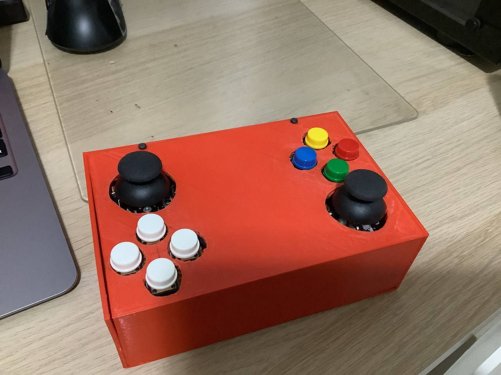

# Bluetooth Gamepad

This repository contains the firmware to the ESP32 generic bluetooth gamepad. It supports 16 buttons (DPAD, Face buttons, Triggers, Bumpers, Start, Mode) and 2 Analog Joysticks. The buttons and pin mapping can be found in ```main/main.c```. The current purpose of this code is to program an ESP32 board directly. Converting it into a reusable library may be considered in the future.
<br>
**This code is based on the example provided by Espressif.**


## How to use

### Hardware Required

- Able to run on any commonly available ESP32 development board, e.g. ESP32-DevKitC.

- Connect to a Classic Bluetooth HID Host device, e.g. laptop or tablet.

- Up to 16 buttons and 2 Analog Joysticks

### Configure the project

```
idf.py menuconfig
```

- Check and enable Classic Bluetooth and Classic BT HID Device under Component config --> Bluetooth --> Bluedroid Options

### Build and Flash

Build the project and flash it to the board, then run monitor tool to view serial output:

```
idf.py -p PORT flash monitor
```

(Replace PORT with the name of the serial port to use.)

(To exit the serial monitor, type `Ctrl-]`.)

See the Getting Started Guide for full steps to configure and use ESP-IDF to build projects.

## Example Output

The following log will be shown on the IDF monitor console:

```
I (572) cpu_start: Starting scheduler on PRO CPU.
I (0) cpu_start: Starting scheduler on APP CPU.
I (663) BTDM_INIT: BT controller compile version [5688ed5]
I (663) system_api: Base MAC address is not set
I (663) system_api: read default base MAC address from EFUSE
I (673) phy_init: phy_version 4670,719f9f6,Feb 18 2021,17:07:07
W (683) phy_init: failed to load RF calibration data (0xffffffff), falling back to full calibration
I (1533) app_main: setting device name
I (1533) esp_bt_gap_cb: event: 10
I (1543) app_main: setting cod major, peripheral
I (3543) app_main: register hid device callback
I (3543) app_main: starting hid device
I (3543) esp_bt_hidd_cb: setting hid parameters
I (3543) esp_bt_gap_cb: event: 10
I (3543) esp_bt_hidd_cb: setting hid parameters success!
I (3553) esp_bt_hidd_cb: setting to connectable, discoverable
I (3563) bt_address: my bluetooth address is 78:E3:6D:CD:02:2A
I (3563) app_main: exiting
```

The messages show the successful initialization of Bluetooth stack and HID application. ESP32 will become discoverable with the Bluetooth device name as "ESP32 Gamepad", by nearby Bluetooth HID Host device.

Connect to ESP32 on the HID Host side, then finish bonding. After that the HID connection will be established. 